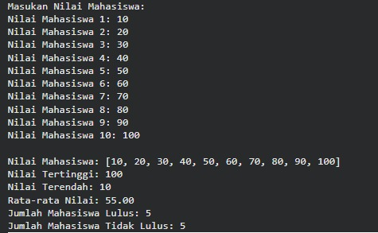
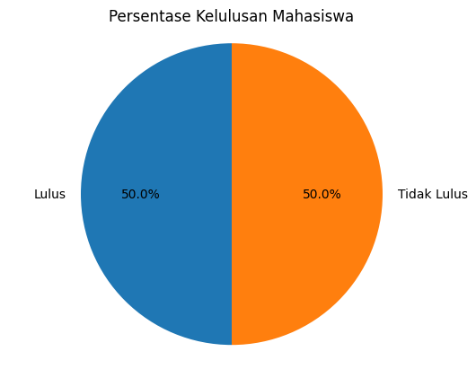
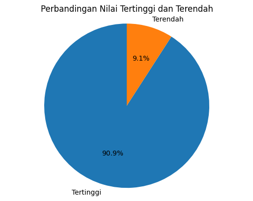

# Program Analisis Nilai Mahasiswa Menggunakan Array

## Deskripsi Program

Program ini dibuat menggunakan bahasa **Python** untuk mengolah data nilai mahasiswa dengan memanfaatkan konsep **array (list)**. Program menerima input nilai dari 10 mahasiswa kemudian melakukan beberapa analisis seperti menentukan nilai tertinggi, nilai terendah, menghitung rata-rata nilai, serta menghitung jumlah mahasiswa yang lulus dan tidak lulus.

Selain itu, program juga menampilkan **visualisasi grafik** untuk mempermudah pemahaman data nilai mahasiswa.

---

# Konsep Array (Penjelasan Umum)

Array adalah struktur data yang digunakan untuk **menyimpan sekumpulan data dalam satu variabel**. Biasanya data yang disimpan memiliki tipe yang sama dan dapat diakses menggunakan **indeks**.

Dalam Python, array biasanya menggunakan **list**.

Contoh sederhana:

```
arr = [70, 80, 90, 60]
```

Pada program ini, array digunakan untuk menyimpan **10 nilai mahasiswa** yang dimasukkan oleh pengguna.

Contoh penggunaan dalam program:

```
arr = []
arr.append(n)
```

Dengan menggunakan array, program dapat dengan mudah melakukan proses seperti:

* mencari nilai tertinggi
* mencari nilai terendah
* menghitung rata-rata
* menghitung jumlah kelulusan

---

# Fitur Program

Program memiliki beberapa fitur utama:

1. Input 10 nilai mahasiswa
2. Menampilkan seluruh nilai yang dimasukkan
3. Menentukan nilai tertinggi
4. Menentukan nilai terendah
5. Menghitung rata-rata nilai mahasiswa
6. Menghitung jumlah mahasiswa yang lulus (nilai ≥ 60)
7. Menghitung jumlah mahasiswa yang tidak lulus
8. Menampilkan grafik perbandingan nilai tertinggi dan terendah
9. Menampilkan grafik persentase kelulusan mahasiswa

---

# Screenshot Hasil Eksekusi

## Output Program



Gambar di atas menunjukkan proses input nilai mahasiswa serta hasil analisis program seperti nilai tertinggi, nilai terendah, rata-rata nilai, dan jumlah mahasiswa yang lulus maupun tidak lulus.

---

## Grafik Persentase Kelulusan Mahasiswa



Grafik ini menampilkan persentase mahasiswa yang **lulus** dan **tidak lulus** berdasarkan batas nilai kelulusan ≥ 60.

---

## Grafik Perbandingan Nilai Tertinggi dan Terendah



Grafik ini memperlihatkan perbandingan antara **nilai tertinggi** dan **nilai terendah** dari data mahasiswa.

---

# Analisis Kompleksitas Algoritma

### 1. Input Nilai Mahasiswa

Menggunakan perulangan sebanyak jumlah mahasiswa.

Kompleksitas waktu:
O(n)

---

### 2. Mencari Nilai Tertinggi dan Terendah

Menggunakan fungsi `max()` dan `min()` yang memeriksa semua elemen array.

Kompleksitas waktu:
O(n)

---

### 3. Menghitung Rata-rata

Menggunakan fungsi `sum()` untuk menjumlahkan seluruh nilai.

Kompleksitas waktu:
O(n)

---

### 4. Menghitung Jumlah Mahasiswa Lulus

Program memeriksa setiap nilai apakah ≥ 60.

Kompleksitas waktu:
O(n)

---

### 5. Pembuatan Grafik

Grafik dibuat dari jumlah data yang tetap sehingga kompleksitasnya konstan.

Kompleksitas waktu:
O(1)

---

# Refleksi Pembelajaran

Melalui pembuatan program ini, saya mempelajari beberapa konsep penting dalam pemrograman Python, yaitu:

* Penggunaan **array (list)** untuk menyimpan banyak data
* Penggunaan **perulangan (loop)** untuk memproses data
* Menghitung nilai statistik seperti maksimum, minimum, dan rata-rata
* Menggunakan **kondisi (if)** untuk menentukan kelulusan mahasiswa
* Membuat **visualisasi data menggunakan grafik**

Program ini membantu memahami bagaimana data dapat diolah dan dianalisis menggunakan struktur data sederhana seperti array.

---

# Teknologi yang Digunakan

* visual studio code
* Python
* Library matplotlib untuk visualisasi grafik
